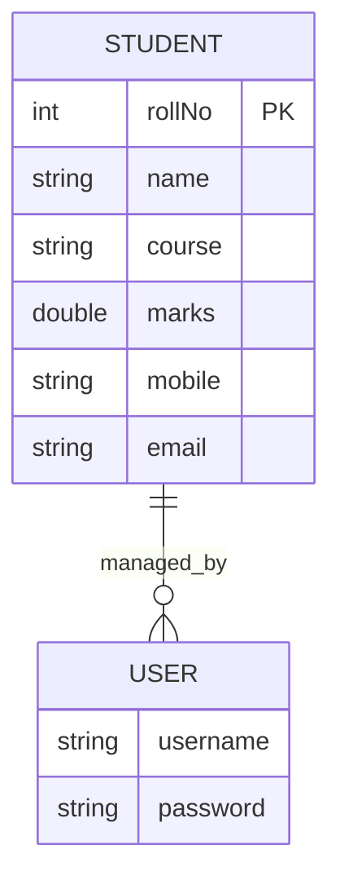
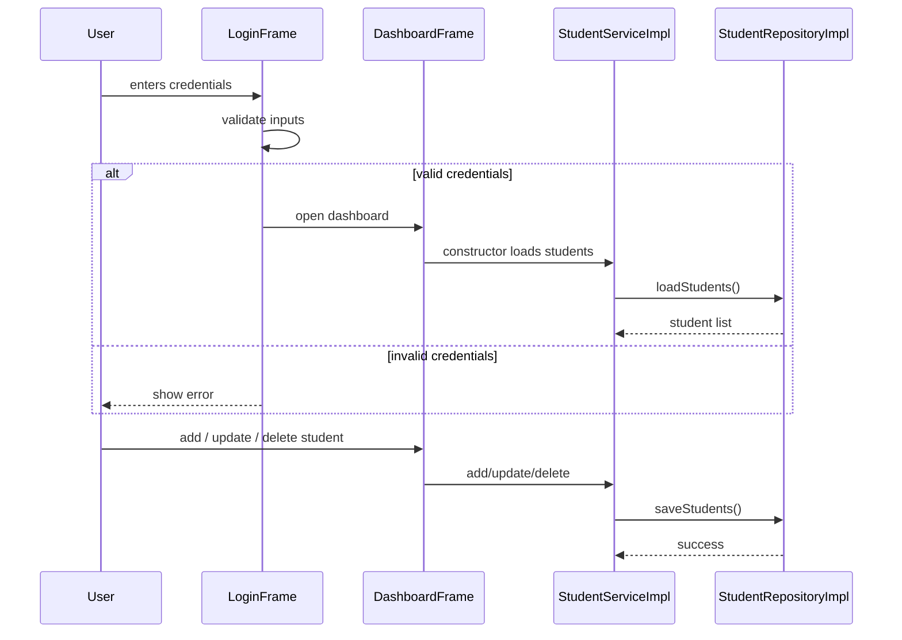
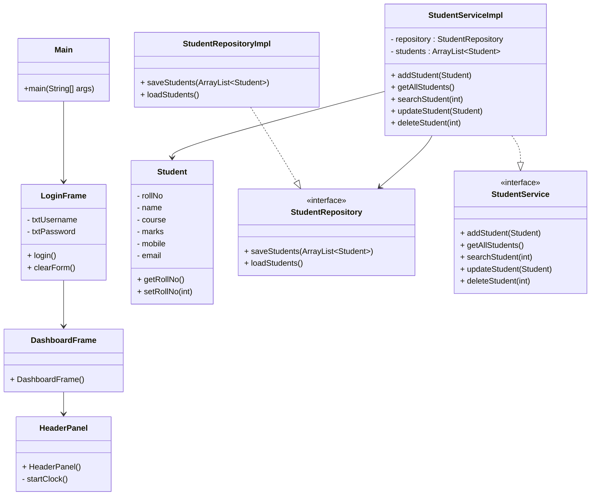
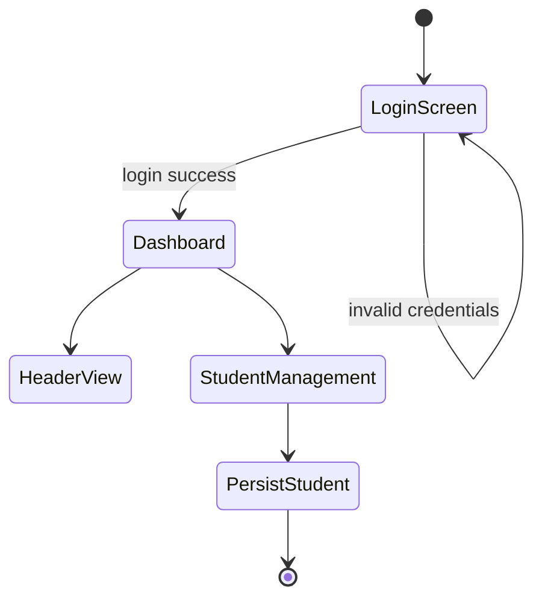

# Student Record Storage System Architecture

## Project Overview

The Student Record Storage System is a Java Swing desktop application for managing student records. It uses a simple layered architecture with UI, controller, service, repository, and model layers.

## Package Structure

- `app`
  - `Main.java` — application entry point.

- `config`
  - `AppConfig.java` — global application constants.

- `model`
  - `Student.java` — student entity with fields, getters/setters, and identity logic.
  - `User.java` — placeholder class for future user modeling.

- `repository`
  - `StudentRepository.java` — persistence interface.
  - `StudentRepositoryImpl.java` — file-based storage using Java serialization.

- `service`
  - `StudentService.java` — student business operations interface.
  - `StudentServiceImpl.java` — implements business rules, validation, and persistence coordination.

- `controller`
  - `NavigationController.java` — toggles UI card panels.
  - `LoginController.java` — placeholder login controller.
  - `StudentController.java` — placeholder student controller.

- `ui`
  - `LoginFrame.java` — login window.
  - `DashboardFrame.java` — main dashboard window.
  - `panel.HeaderPanel.java` — header section with live clock.
  - `component` — custom Swing components for styling.

- `util`
  - `DateUtil.java` — placeholder date utility.
  - `ValidationUtil.java` — placeholder validation utility.

## Core Data Model

### `Student`

Fields:
- `rollNo` (int)
- `name` (String)
- `course` (String)
- `marks` (double)
- `mobile` (String)
- `email` (String)

Behavior:
- `equals()` and `hashCode()` are based on `rollNo`.
- Provides full JavaBean-style getters and setters.

## Flow of Control

1. `Main.main()` starts the application and opens `LoginFrame` on the Swing event thread.
2. `LoginFrame` displays username/password fields and login/clear buttons.
3. On successful login (`admin` / `admin123`), `DashboardFrame` is opened and `LoginFrame` is disposed.
4. `DashboardFrame` currently displays `HeaderPanel` and sets up the dashboard frame.
5. `StudentServiceImpl` loads students from disk at construction using `StudentRepositoryImpl`.
6. Student CRUD operations are performed through `StudentServiceImpl`.
7. Data is persisted back to `student.ser` after add, update, or delete.

## Persistence Logic

### `StudentRepositoryImpl`

- `saveStudents(ArrayList<Student> students)`
  - Serializes the student list to `student.ser`.
- `loadStudents()`
  - Reads `student.ser` if it exists and returns the stored list.
  - Returns an empty list if the file is missing or if deserialization fails.

## Business Logic

### `StudentServiceImpl`

- Maintains an in-memory `ArrayList<Student>` loaded from storage.
- `addStudent(Student student)`
  - Prevents duplicate roll numbers.
  - Adds a new student and persists the list.
- `getAllStudents()`
  - Returns the live in-memory list.
- `searchStudent(int rollNo)`
  - Finds a student by roll number.
- `updateStudent(Student updatedStudent)`
  - Finds the existing student by roll number.
  - Updates fields if found and persists the list.
- `deleteStudent(int rollNo)`
  - Removes the student and persists the list.

## UI Flow

### `LoginFrame`

- Validates that username and password are entered.
- Checks hard-coded credentials.
- On success shows `DashboardFrame`.
- `clearForm()` resets the login fields.

### `DashboardFrame`

- Sets up the main window and includes `HeaderPanel`.
- Does not yet contain the student management panel or navigation wiring.

### `HeaderPanel`

- Displays the app title, subtitle, welcome message, date, time, and logout button.
- Uses a Swing `Timer` to refresh the clock every second.

## Notable Gaps and Placeholders

- `User`, `LoginController`, `StudentController`, `DashboardPanel`, `StudentPanel`, `SidebarPanel`, `StatusPanel`, `DateUtil`, and `ValidationUtil` are currently empty placeholders.
- The dashboard is not fully wired to student management operations.
- There is no database; persistence is file-based serialization.

## Diagrams

### Entity Relationship Diagram (ERD)



> Note: `User` is a placeholder entity. Current implementation only persists `Student`.

### Flowchart

```mermaid
flowchart TD
    A[Start Application] --> B[Main.main()]
    B --> C[Open LoginFrame]
    C --> D{Login Clicked}
    D -->|Invalid| E[Show error message]
    D -->|Valid| F[Open DashboardFrame]
    F --> G[Load HeaderPanel]
    G --> H[User interacts with student UI]
    H --> I[StudentServiceImpl operation]
    I --> J[StudentRepositoryImpl persists student.ser]
    J --> K[End]
```

### Sequence Diagram



### Class Diagram



### UML Diagram



## Summary

This documentation describes current application logic, package relationships, and the key flow for login and student persistence. The system is architected for a layered UI-service-repository design, with a file-backed student repository and a Swing interface.
