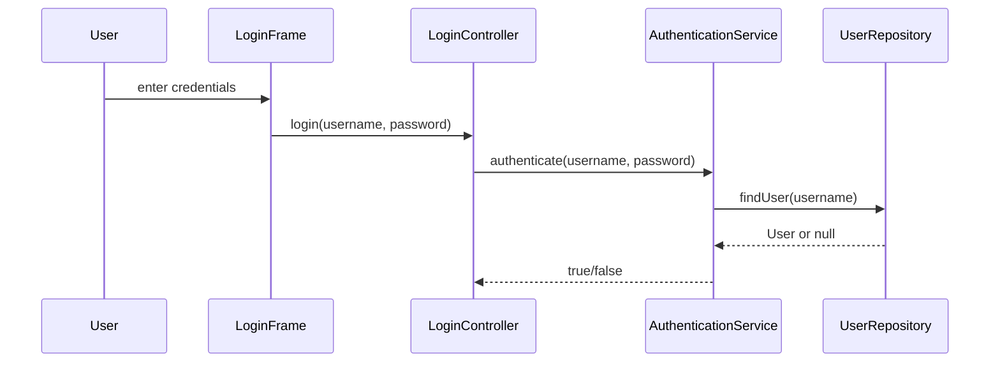
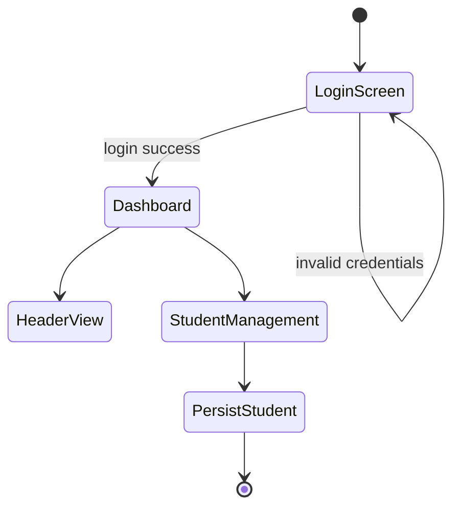

# Student Record Storage System Architecture

## Project Overview

The Student Record Storage System is a Java Swing desktop application for managing student records. The application follows a layered architecture with presentation, controller, service, repository, and model components. The current implementation already includes a login flow, a dashboard shell, and a student service layer backed by file-based persistence.

## Layered Structure

### Presentation Layer

Located in the `ui` package.

- `LoginFrame` renders the login screen and collects credentials.
- `DashboardFrame` creates the main window shell for the application.
- `HeaderPanel` displays the title, welcome text, clock, and navigation area.
- UI component classes such as `CardPanel`, `PrimaryButton`, and `FormTextField` provide reusable Swing styling.

### Controller Layer

Located in the `controller` package.

- `LoginController` passes login credentials to the authentication service.
- `NavigationController` is present as a placeholder for future panel switching and card-based navigation.

### Service Layer

Located in the `service` package.

- `AuthenticationService` validates the supplied username and password.
- `StudentService` manages student CRUD operations and coordinates persistence.

### Repository Layer

Located in the `repository` package.

- `UserRepository` provides the current user lookup logic for login.
- `StudentRepository` saves and loads student data using Java serialization.

### Model Layer

Located in the `model` package.

- `Student` stores the core student record fields.
- `User` represents the authenticated account used by the login flow.

## Core Data Model

### Student

Fields:
- `studentId`
- `firstName`
- `lastName`
- `gender`
- `dateOfBirth`
- `course`
- `mobileNumber`
- `email`
- `address`

Behavior:
- Uses `studentId` as the identity field for duplicate checks and updates.
- Provides standard getter and setter methods for Swing integration and service logic.

## Runtime Flow

### 1. Application startup

`Main.main()` launches the application on the Swing event dispatch thread and opens the login window.

### 2. Authentication flow

1. `LoginFrame` captures the username and password.
2. `LoginController` forwards the values to `AuthenticationService`.
3. `AuthenticationService` queries `UserRepository`.
4. A known admin account is accepted, and the dashboard can be opened.



### 3. Dashboard flow

After authentication succeeds, the app opens `DashboardFrame`, which initializes the shell UI and header panel.

### 4. Student data flow

`StudentService` loads the list of students from `data/student.dat` when created, and any add/update/delete operation is persisted back to the same file.

```mermaid
flowchart TD
    A[Start Application] --> B[Main.main()]
    B --> C[Open LoginFrame]
    C --> D[Authenticate user]
    D --> E[Open DashboardFrame]
    E --> F[StudentServiceImpl loads students]
    F --> G[StudentRepositoryImpl persists student.ser]
```

## Persistence Design

The current persistence layer is file-based and uses Java object serialization.

- `StudentRepository.saveToFile()` writes the current list to `data/student.dat`.
- `StudentRepository.loadFromFile()` reads the file if it exists and returns its contents.
- If the file is missing or unreadable, the service starts with an empty list.

## Current Status and Notes

- The authentication path and student service layer are implemented.
- The dashboard is currently a functional shell rather than a full student-management UI.
- The project is ready for future expansion into richer navigation, full CRUD forms, and a database-backed persistence layer.
    StudentServiceImpl --> StudentRepository
    StudentServiceImpl --> Student
```

### UML Diagram



## Summary

This documentation describes current application logic, package relationships, and the key flow for login and student persistence. The system is architected for a layered UI-service-repository design, with a file-backed student repository and a Swing interface.
