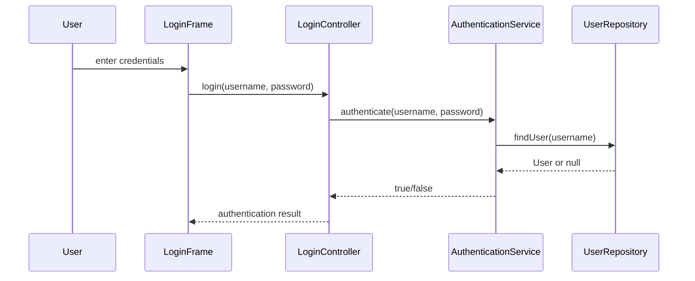
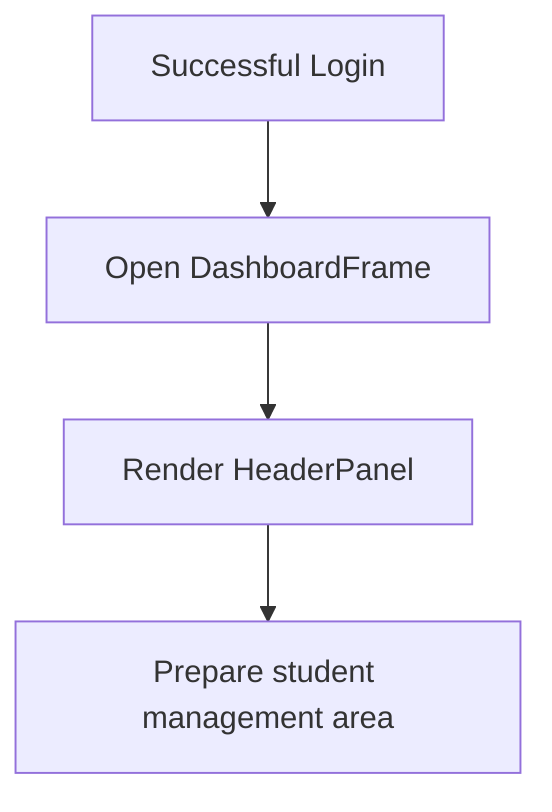
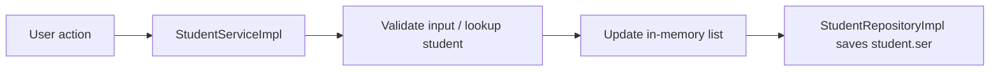

# Updated Application Flow

## Overview

This project follows a layered Swing desktop architecture with a clear separation between UI, controllers, services, repositories, and models. The current implementation provides the startup shell, authentication service layer, and file-based student persistence, while the full UI wiring for login and student management is still being completed.

## 1. Application Startup

When the application starts, the entry point in Main launches the login window on the Swing event dispatch thread.

```mermaid
flowchart TD
    A[Start Application] --> B[Main.main()]
    B --> C[Open LoginFrame]
    C --> D[Show login form]
```

## 2. Login Flow

The login experience is designed around the following path:

1. The user enters a username and password in LoginFrame.
2. LoginController delegates the request to AuthenticationService.
3. AuthenticationService validates the credentials against UserRepository.
4. UserRepository returns a User object for the known admin account.
5. A successful authentication opens the dashboard, while a failed attempt shows an error message.

> Current status: the authentication service and controller classes are present, and the LoginFrame button action is wired to the controller.



## 3. Dashboard Flow

After successful authentication, the app opens the main dashboard window. The current dashboard implementation is a shell that displays the header section and sets up the main window frame.



## 4. Student Record Lifecycle

The student management flow is handled by `StudentService` and `StudentRepository`.

- Add Student
  - checks for duplicate student IDs
  - stores the student in memory
  - saves the list to disk
- Search Student
  - finds a student by keyword across ID, first name, last name, and course
- Update Student
  - updates existing values in memory
  - persists the updated list
- Delete Student
  - removes the student from memory
  - persists the updated list



## 5. Persistence Model

Student records are persisted using Java object serialization in a file named student.ser.

- The repository loads existing students when the service starts.
- Each add/update/delete operation rewrites the serialized file.
- If the file is missing, the system starts with an empty list.

## 6. Current Implementation Notes

- The login controller and authentication service are in place.
- The UI currently renders the login form and dashboard shell.
- The student CRUD service and repository are implemented.
- The full navigation between forms and panels is still being completed.
